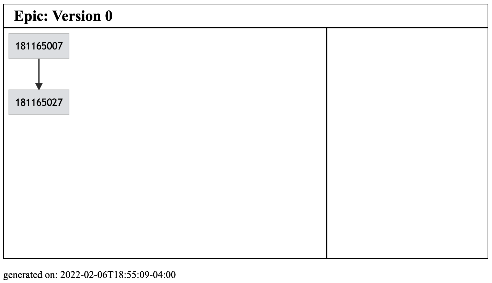

# Pivotal tracker epic diagrams

This repo creates a diagram of tickets and their blockers for a particular epic.


## How does this work

This project makes calls to Pivotal tracker's API to fetch all the stories and
their blockers. Once these have been retrieved we find the ticket ids within
the blocker's descriptions. Finally we generate a `.mmd` file which is passed
to a tool called [Mermaid.js](https://mermaid-js.github.io/mermaid/#/) which
takes this file and generates both a `.png` version of the dependency graph
(see example below) and an `.svg` version of the dependency graph.




## Configuration

This program is configured using the `.env` file. This file will load
environment variables the program starts.

- `PIVOTAL_TRACKER_TOKEN` - API token for Pivotal tracker
- `PROJECT_ID` - The project id that contains the epic.
- `EPIC_LABEL` - The label of the Epic you want to draw


## Dependencies

This program is written in the Rust programming language. This can be installed
with the tool `rustup`. This repo also assumes that you use `nvm` to manage
node versions.


## To generate diagrams

```
nvm use
npm install
./generate
```


## Possible improvements

- [ ] Turn this into a webpage
    - The diagram generated should have a hover state that doesn't work when
      rendered as an SVG. If this was a webpage (even locally hosted) this
      could allow us to have the diagrams "refreshable" via a button in a
      frontend
- [ ] We could save some API calls by fetching the blocker ids when we get the
      list of stories and not make API calls for stories with no blocker ids.
